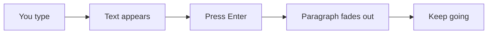
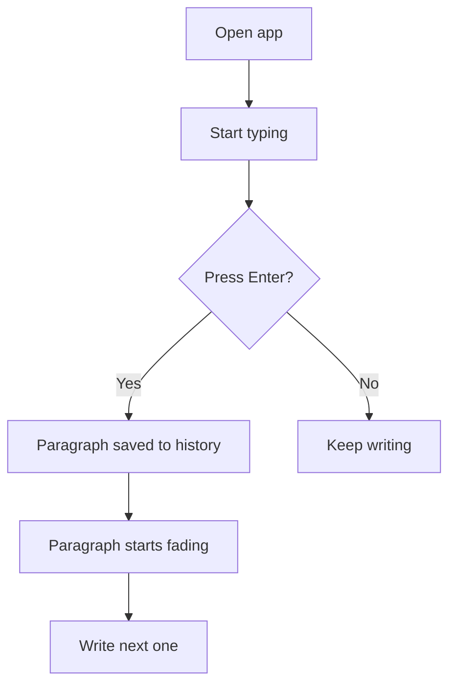
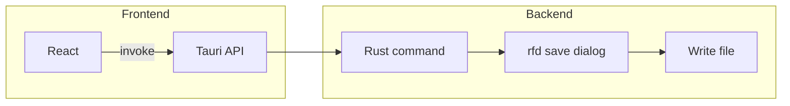

# faintly

write and forget.



everything you commit slowly fades into the background. no backspace, no editing old drafts - just forward motion.



## stack

- frontend: react + tailwind + typescript
- backend: rust + tauri 2
- export: native save dialog, writes .md / .txt



## run it

```bash
npm install
npm run tauri dev
```

## build

```bash
npm run tauri build
```

exe ends up in `src-tauri/target/release/`. no server, no cloud, no bullshit.

## why

sometimes the only way to get words out is to not look at them again.
